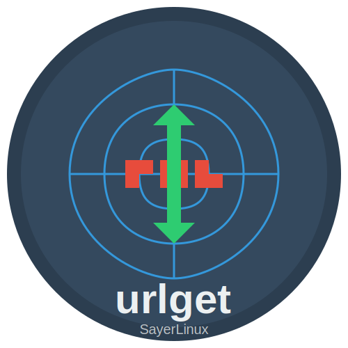

# urlget

<div align="center">
  
  <p>أداة اختبار أمان الويب متعددة الوظائف</p>
</div>

## نظرة عامة

**urlget** هي أداة قوية مكتوبة بلغة بايثون لاختبار أمان تطبيقات الويب. تم تطويرها بواسطة [SayerLinux](https://github.com/SaudiLinux) لتوفير مجموعة شاملة من الأدوات للمختبرين والباحثين في مجال الأمان.

## الميزات الرئيسية

- **زحف قائم على Chrome**: اكتشاف نقاط الضعف في تطبيقات الويب الديناميكية ومواقع HTML5 وتطبيقات الصفحة الواحدة (SPA)، مع دعم المواقع التي تتطلب تسجيل الدخول.
- **القوة الغاشمة والتشويش**: تنفيذ هجمات القوة الغاشمة والتشويش بشكل أسرع باستخدام تسلسلات مخصصة من طلبات HTTP مع مجموعات حمولة متعددة.
- **اختبار XSS والثغرات المماثلة**: اكتشاف المدخلات المنعكسة أو المخزنة لاختبار ثغرات XSS والثغرات المماثلة.
- **إنشاء استغلالات CSRF**: إنشاء ملفات HTML استغلالية توضح هجمات CSRF لأي طلب مناسب.
- **اختطاف نظام أسماء النطاقات (DNS)**: تنفيذ هجمات اختطاف DNS لاختبار أمان البنية التحتية للشبكة.

## متطلبات النظام

- نظام تشغيل لينكس (الأداة تعمل فقط على نظام لينكس)
- بايثون 3.6 أو أحدث
- متصفح Chrome/Chromium
- صلاحيات الجذر (root) لبعض الوظائف مثل اختطاف DNS

## التثبيت

```bash
# تثبيت الأداة من مصدرها
git clone https://github.com/SaudiLinux/urlget.git
cd urlget
pip install -e .

# أو التثبيت مباشرة من PyPI
pip install urlget
```

## الاستخدام الأساسي

### واجهة سطر الأوامر

```bash
# عرض المساعدة
urlget --help

# الزحف على موقع ويب
urlget crawl --url https://example.com --depth 3 --output results.json

# تنفيذ هجمات القوة الغاشمة والتشويش
urlget fuzz --url https://example.com/login --method POST --data "username=FUZZ&password=FUZZ" --wordlist wordlist.txt

# اختبار ثغرات XSS
urlget xss --url https://example.com/search --param q

# إنشاء استغلال CSRF
urlget csrf --request-file request.txt --output csrf-exploit.html

# تنفيذ اختطاف DNS
sudo urlget dns-hijack --interface eth0 --spoof example.com,A,192.168.1.100
```

### استخدام المكتبة في البرمجة

```python
from urlget.crawler import ChromeCrawler
from urlget.fuzzer import HTTPFuzzer
from urlget.xss import XSSScanner
from urlget.csrf import CSRFGenerator
from urlget.dns_hijack import DNSHijacker

# مثال للزحف
crawler = ChromeCrawler(url="https://example.com", depth=2)
results = crawler.crawl()

# مثال للقوة الغاشمة
fuzzer = HTTPFuzzer(url="https://example.com/login", method="POST")
fuzzer.load_payloads("wordlist.txt")
fuzzer.fuzz({"username": "FUZZ", "password": "FUZZ"})

# مثال لاختبار XSS
scanner = XSSScanner(url="https://example.com/search")
vulnerabilities = scanner.scan_parameter("q")

# مثال لإنشاء استغلال CSRF
generator = CSRFGenerator()
generator.load_request_from_file("request.txt")
generator.generate_exploit("csrf-exploit.html")

# مثال لاختطاف DNS
hijacker = DNSHijacker(interface="eth0")
hijacker.add_spoof_record("example.com", "A", "192.168.1.100")
hijacker.start()
```

## الوثائق

للحصول على وثائق مفصلة حول كل وحدة وخيارات الاستخدام المتقدمة، يرجى زيارة [الوثائق الكاملة](https://github.com/SaudiLinux/urlget/wiki).

## المساهمة

نرحب بالمساهمات! إذا كنت ترغب في المساهمة في تطوير urlget، يرجى اتباع الخطوات التالية:

1. قم بعمل fork للمشروع
2. قم بإنشاء فرع للميزة الجديدة (`git checkout -b feature/amazing-feature`)
3. قم بتنفيذ التغييرات الخاصة بك
4. قم بعمل commit للتغييرات (`git commit -m 'إضافة ميزة رائعة'`)
5. قم بدفع الفرع (`git push origin feature/amazing-feature`)
6. قم بفتح طلب سحب (Pull Request)

## الترخيص

هذا المشروع مرخص تحت رخصة MIT - انظر ملف [LICENSE](LICENSE) للتفاصيل.

## معلومات الاتصال

- المؤلف: SayerLinux
- البريد الإلكتروني: SaudiLinux1@gmail.com
- GitHub: [https://github.com/SaudiLinux](https://github.com/SaudiLinux)

## شكر وتقدير

شكر خاص لجميع المساهمين والمجتمع الذين ساعدوا في تطوير هذه الأداة.